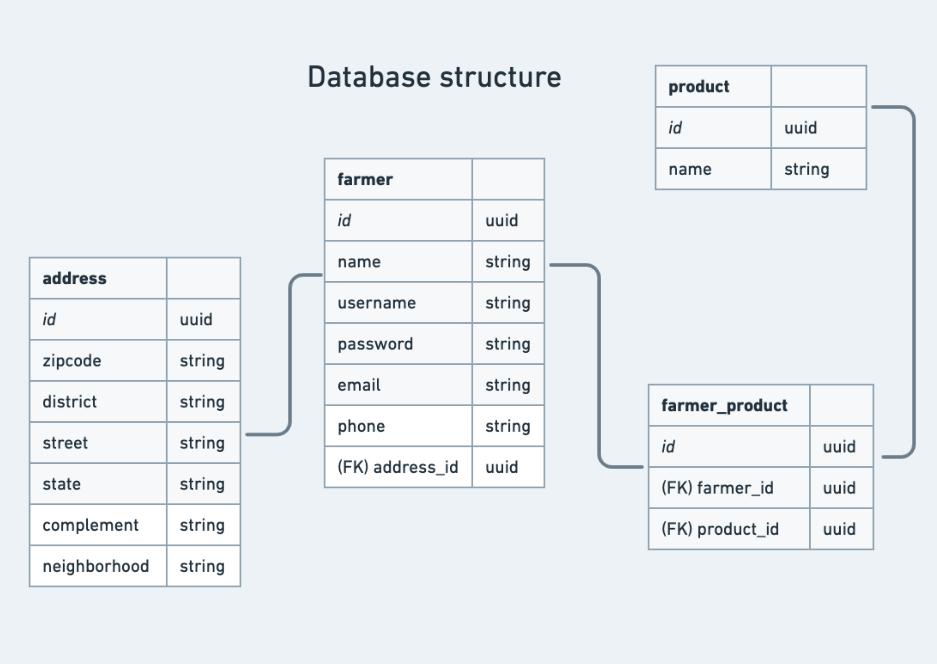

<h1 align="center">
  Horta-facil
</h1>

  <a href="#-Technologies">Technologies</a>&nbsp;&nbsp;&nbsp;|&nbsp;&nbsp;&nbsp;
  <a href="#-Project">Project</a>&nbsp;&nbsp;&nbsp;|&nbsp;&nbsp;&nbsp;
  <a href="#memo-Info">Info</a>&nbsp;&nbsp;&nbsp;|&nbsp;&nbsp;&nbsp;
    <a href="#memo-Diagram">Diagram</a>

 

  

 

  

## 🚀 Technologies

Esse projeto foi desenvolvido com as seguintes tecnologias:

Server(API Rest): 
- Java
- Spring Boot 
- Spring Web
- Spring Data JPA
- Lombook
- PostgreSQL

Client
- Javascript
- HTML
- CSS
- Bootstrap

 

## 💻 Project

O Projeto se chama Horta-facil pois tem o intuito de auxiliar as pessoas a encontrarem hortas de mini-agricultores mais próximas as suas casas. 

No Backend estamos consumindo a API da Google Distance Matrix para nos auxiliar no calculo da Quilometragem e de tempo de percurso dentre o usuário e as rotas. No fronted estamos consumindo a API da ViaCep para nos auxiliar na localização do endereço correto.
 

## :memo: Info

Para testar a aplicação siga os passos abaixo:

-> É NECESSÁRIO TER O BANCO DE DADOS POSTGRESS INSTALADO
-> É NECESSÁRIO TER UMA CHAVE DE API DA GOOGLE 
  <a href="https://developers.google.com/maps/documentation/distance-matrix/overview#:~:text=The%20Distance%20Matrix%20API%20is,distance%20values%20for%20each%20pair./">Docs API Google</a>
 
[x] Baixe o projeto
[x] Acesse o arquivo application.properties e defina as credênciais do seu banco
[x] É necessário ter o Java na versão 8.1 + e o Maven instalados
[x] Com o terminal aberto no diretório do projeto execute os comandos para baixar as dependências e startar o servidor: 
  - mvn install
  - mvn spring-boot:run
[x] Após isso execute os seguintes comandos para startar o client-side:
  - cd src/public
  - npx lite-server

 
-------------------------------------------------------------------------------

## :memo: Diagram

  

